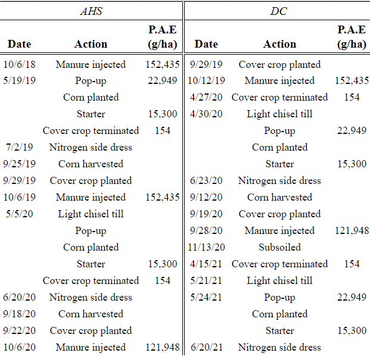

# Appendix - Figures and Tables in Manuscript 
  
```{r setup, echo = FALSE}
knitr::opts_knit$set(root.dir = 'C:/RAR-Uvm/Data/Data for thesis - AHS swap')

```
  
```{r echo=FALSE, message=FALSE, warning=FALSE}
library(tidyverse)
library(knitr)
library(sjPlot)
library(lubridate)
library(table1)
library(kableExtra)
library(flextable)
library(purrr)
library(xtable)
library(Hmisc)
library(huxtable)
library(corrplot)
library(ggpubr)
library(gridExtra)
library(agricolae)
library(ggpmisc)
```
   
```{r echo=FALSE, message=FALSE}
load('work1.Rdata')
load('work2.Rdata')
load('work3.Rdata')
```

**Table 1**
  
```{r figurename1, echo=FALSE, fig.width=170}


# note you need to have a copy of the .png in the directory where the html is going ot be saved to for it to work, not sure why but this solutions worked for me
```
  
  
**Table 2**
  
```{r, echo = FALSE, warning = FALSE, message = FALSE}

options(knitr.kable.NA = '')

wrf %>%
  kbl(align = "c",escape = F) %>%
  kable_classic(html_font = 'Times', font_size = 14, full_width = F) %>%
  add_header_above(c(" " = 2, rep(c("Baseflow"=2, "Event"=2, " " = 1),3))) %>%
  add_header_above(c(" " = 2, "2019" = 4, " " = 1, "2020" = 4, " " = 1, "2021" = 4, " " = 1)) %>%
  # add_header_above(c(" " = 1, "TP Loading (g/ha) by Water Year (Oct-Sep)\nG = Growing Season (May-Sep), NG = Non-growing" = 15))%>%
  collapse_rows(., columns = 1, valign = 'middle')%>%
  row_spec(c(3,6), extra_css = "border-bottom: 1px solid")%>%
  kableExtra::footnote(general = "Sampling errors resulted in the following number of missing events and load estimates:", 
           alphabet = c(
             "Growing: 1 event, 171 g/ha, Non-Growing: 4 events, 261 g/ha",
             "Growing: 3 events, 64 g/ha, Non-Growing: 7 events, 630 g/ha",
             "Non-Growing: 14 events, 2770 g/ha",
             "Growing: 1 event, 2 g/ha",
             "Non-Growing: 14 events, 555 g/ha",
             "Growing: 1 event, 3 g/ha"
             )
          )
```
  
  
```{r, echo = FALSE, warning = FALSE, message = FALSE, results='hide', fig.width=16,fig.height=15, fig.asp = .62}

# multiple boxplots, from: https://stackoverflow.com/questions/22876248/plot-multiple-box-plots-using-columns-of-dataframe-in-r

# function for sapply loop
get_plot_limits <- function(plot) {
    gb = ggplot_build(plot)
    xmin = gb$layout$panel_params[[1]]$x.range[1]
    xmax = gb$layout$panel_params[[1]]$x.range[2]
    ymin = gb$layout$panel_params[[1]]$y.range[1]
    ymax = gb$layout$panel_params[[1]]$y.range[2]
    list(xmin = xmin, xmax = xmax, ymin = ymin, ymax = ymax)
}

# list to append plots in sapply loop into
plots<-list()

# select plotting variables
df1<-Total%>%dplyr::select(c(Season4,Volume,RR,mhri,response_time,ttpm,TP.Load,TP.Conc,SRP.Load,SRP.Conc))
df1<-df1%>%setNames(c("Season", "Volume (mm)", "Runoff Ratio", "Max Rainfall Intensity (mm/day)", "Response Time (min)", "Time to Peak Flow (min)", "TP Load (g/ha)", "TP FWMC (ug/L)", "SRP Load (g/ha)", "SRP FWMC (ug/L)"))


# create plots and perform dunns tests for letters above boxplots
i<-2
sapply(seq_along(df1)[-1], function(i) {
  # get response variable
  df_use<-data_frame(df1[, i],df1$Season)
  colnames(df_use)<-c('y', 'Season')
  
  # make ggplot
  plt1 <- ggplot(data = df_use, aes(x=Season, y=y)) + geom_boxplot() +       geom_jitter(alpha=0.6, width=0.1) + ylab(as.character(names(df1)[i])) + xlab(NULL) + theme_minimal()
     
  # perform KW, dunns test, get letters
  test <- kruskal.test(y ~ Season, df_use)
  dunn <- FSA::dunnTest(y~Season, df_use)
  dunn<-dunn$res
  
  # rest of sapply is excute from here, but need tryCatch to account for error when there are o signfncant differences between seasons
  
  t <- try(rcompanion::cldList(P.adj~Comparison, data = dunn),silent = TRUE)
  
  if (class(t) == "try-error") {
    p<-plt1
  }
  
  if(class(t) != "try-error") {
    
    cld <- rcompanion::cldList(P.adj~Comparison, data = dunn)
    
    ## plot letters above boxplots - modified from https://john-qu
    # ensen.com/r/compact-letter-displays/
    
    # create plotting dataframe for geom_text
    x <- c(1:length(cld$Letter))
    y <- aggregate(y~Season, df_use, max)[,2] # get coordinates of top of boxes
    cbd <- cld$Letter
    
    ltr_df <- data.frame(x, y, cbd)
    
    lmts <- get_plot_limits(plt1)
    y.range <- lmts$ymax - lmts$ymin
    y.nudge <- 0.05 * y.range
    
    # add letter text to plot
    p<-plt1 + geom_text(data = ltr_df, aes(x=x, y=y, label=cbd), nudge_y = y.nudge)
  }
  
  plots[[i-1]]<<-p
  
})

n <- length(plots)
nCol <- 5 # floor(sqrt(n))
do.call("grid.arrange", c(plots, ncol=nCol))

```
  
**Figure 1**
  
  
```{r, echo = FALSE, warning = FALSE, message = FALSE, results='hide'}

# pivot longer for ggplot
melt<-bottles%>%
  pivot_longer(c(TP, SRP), names_to = 'Metric', values_to = 'Value')

my.formula <- y ~ x # used in stat_poly_eq

melt%>%
  ggplot(., aes(x = Flow,y = Value, color = Metric)) +
  geom_smooth(data = filter(melt, Time > 10),method = "lm",formula = my.formula,se = FALSE, linetype = 'dashed')+
  stat_poly_eq(data = filter(melt, Time > 10),
    formula = my.formula,
               aes(label = paste(..eq.label.., ..rr.label.., ..p.value.label.., sep = "*plain(\",\")~")),
               parse = T) +
  geom_point()+
  scale_color_grey(start=0.1, end=0.5,)+
  geom_point(data = filter(melt, Time < 10), color = 'green')+
  labs(colour = "P Species") +
  xlab("Flow (mm/day)") +
  ylab("Concentration (ug/L)")+
  theme(text = element_text(size=10))+
  theme_minimal()


```
  
**Figure 2**  
  
  
**Table 4**
```{r echo = FALSE, warning = FALSE}
# the way this code is set up is to use logical indexing to select the Flow and time metrics, which alternate in the orgninal dataframe. 
EC_format<-EC[,c(3,6,14,21:36)]

names(EC_format)<-  c("siteXevent","Flow Volume (mm)","Time to Peak (hr)",
  "QF","QF TtP","SF" ,"SF TtP", "Old", "Old TtP" ,"New", "New TtP","QF old",   "QF old TtP","QF new","QF new TtP"  ,"SF old","SF old TtP","SF new","SF new TtP")

# Flow and time metrics
df_comb<-EC_format %>% pivot_longer(!siteXevent, names_to = 'Metric', values_to = 'Value')

## need to get a dataframe for fraction of quick flow and set it up with alternating rows of FQF values and NA's to be placeholders for Timing metrics

# set up EC and extract just flow, then FQF metrics
rownames(EC_format)<-EC_format[,1]
EC_format[,1]<-NULL
even_indexes<-seq(2,ncol(EC_format),2)
odd_indexes<-seq(1,ncol(EC_format)-1, 2)
df_flow<-EC_format[,odd_indexes]

# divide to get FQF
df_flow<-df_flow/df_flow[,1]
df_flow_long<-df_flow%>% pivot_longer(cols = everything(), names_to = "Metric", values_to = "Value")

# add alternating rows of NA's as Time metric placeholder
na.df <- data.frame(Metric = NA, Value = NA)
df_flow_long_full <- do.call(rbind, apply(df_flow_long, 1, function(x) {rbind(x, na.df)}))
df_flow_long_full$Value<-as.numeric(df_flow_long_full$Value)

# set FQF of flow to NA
df_flow_long_full$Value[df_flow_long_full$Metric == "Flow Volume (mm)"]<-NA

# create full dataframe for use in table 1
df1<-data.frame(siteXevent = df_comb$siteXevent[c(TRUE, FALSE)], Flow = df_comb$Metric[c(TRUE, FALSE)], Flow_Value = df_comb$Value[c(TRUE, FALSE)], Time = df_comb$Metric[c(FALSE, TRUE)], Time_Value = df_comb$Value[c(FALSE, TRUE)], FTF = df_comb$Metric[c(TRUE, FALSE)], FTF_Value = df_flow_long_full$Value[c(TRUE,FALSE)])

# remove name columns, just keeping the names from the flow for using in table
df2<-df1[,-c(1,4,6)]
df3<- df2 %>%
  pivot_longer(cols = -Flow) %>%
  dplyr::group_by(Flow) %>%
  dplyr::mutate(rn = row_number()) %>%
  pivot_wider(names_from = Flow, values_from = value)
df3<-df3[,-2]
df3$name<-as.factor(df3$name)
levels(df3$name)<-c("Flow Metric", "FTF", "TTP")


table1::t1flex(table1::table1(~ `Flow Volume (mm)`+ QF + SF + New + Old +`QF old`+`QF new`+ `QF new`+`SF old`+`SF new`|name, data = df3, overall = F))%>% flextable::fit_to_width(max_width = 7.5)

```
  
  
```{r echo=FALSE, fig.keep='all', message=FALSE, warning=FALSE, results='hide'}
plots<-list()

# names of plots units
pun<-c("hr", "mm", "mm/day", "g/ha/day", "g/ha/day", "g/ha/day", "mm/day")

sapply(seq_along(rainfall_pulse)[-1], function(i) {
  # get response variable
  df_use<-data_frame(rainfall_pulse[, i],rainfall_pulse$Q)
  colnames(df_use)<-c('y', 'Q')
  
  # perform KW 
  test <- kruskal.test(y ~ Q, df_use)
  pvalue <- test$p.value
  # pvalueformatted <- format(pvalue, digits=3, nsmall=2) # not using this since MDPI wants sci notoation to look diff, see below
  
  # MDPI wants scieific notation to be ' x 10^2' instead of 'e2', here is my solution:
  pvalue_round<-format(pvalue, digits=3, nsmall=2)
  pvalueformatted<- ifelse(pvalue < 0.001, '< 0.001', paste('=', pvalue_round)) 
  
  # make ggplot
  
  # apply jitter to outside boxes, create second dataframe
  df_use2 <- df_use %>%
  group_by(Q) %>%
  mutate(outlier = y > median(y) + IQR(y) * 1.5) %>%
  ungroup()
  
  
  jitter <- position_jitter(width = 0.1)
  
  p<-ggplot(df_use2) +
    aes(x = Q, y = y) +
    geom_boxplot(outlier.shape = NA, width = .5) +  
    # NO OUTLIERS
   geom_point(data = function(x) dplyr::filter(x, outlier), position = jitter) +
    ylab(pun[i-1]) + xlab(NULL) + 
    ggtitle(paste(colnames(rainfall_pulse)[i], "\nKW p-val", pvalueformatted))+
    theme_minimal() +
    theme(plot.title = element_text(size = 7.5, face = "bold")) 

  plots[[i-1]]<<-p
})

ggarrange(plotlist=plots, ncol = 3, nrow = 3, heights=c(4,4,4,4,4,4,4), widths=c(1,1,1,1,1,1,1))

```
  
**Figure 3**


