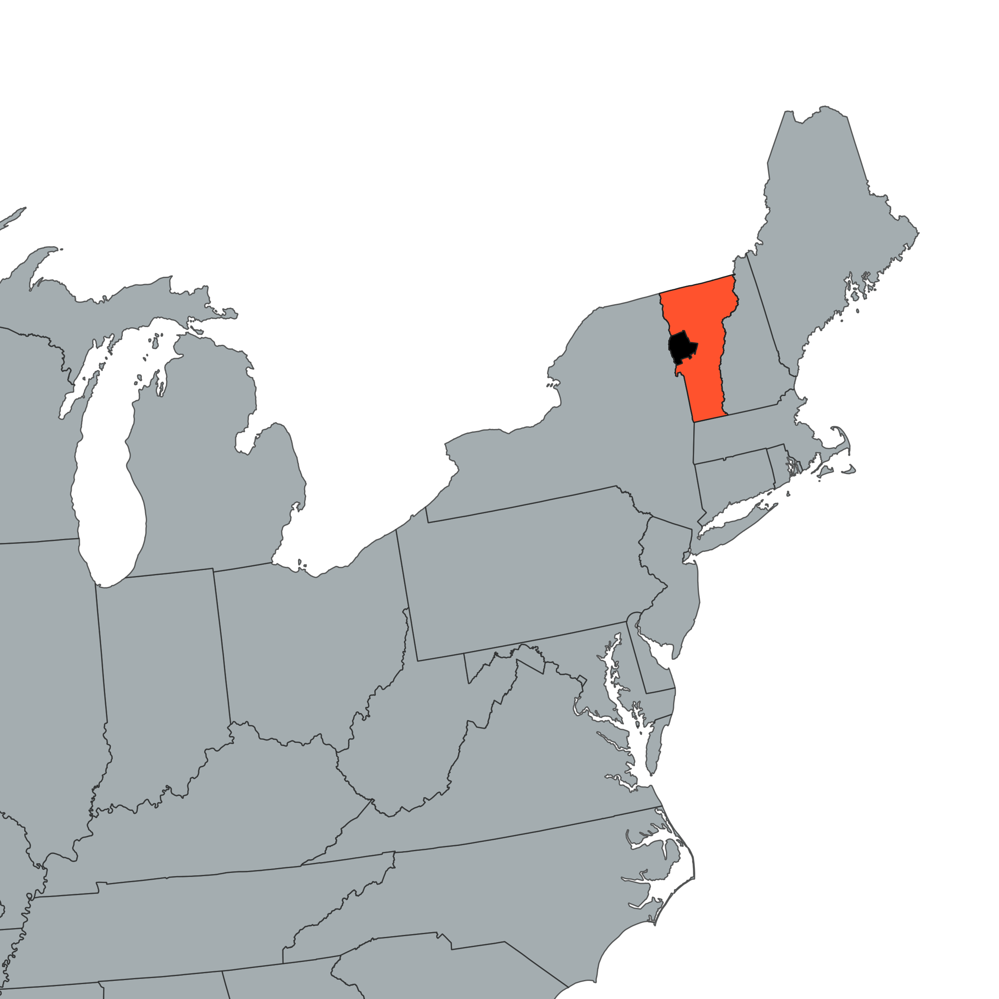
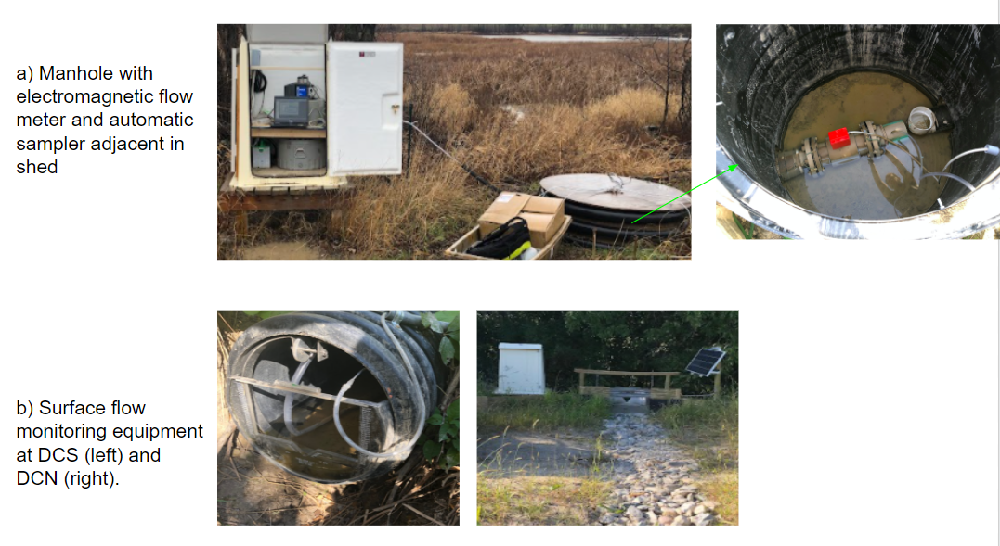
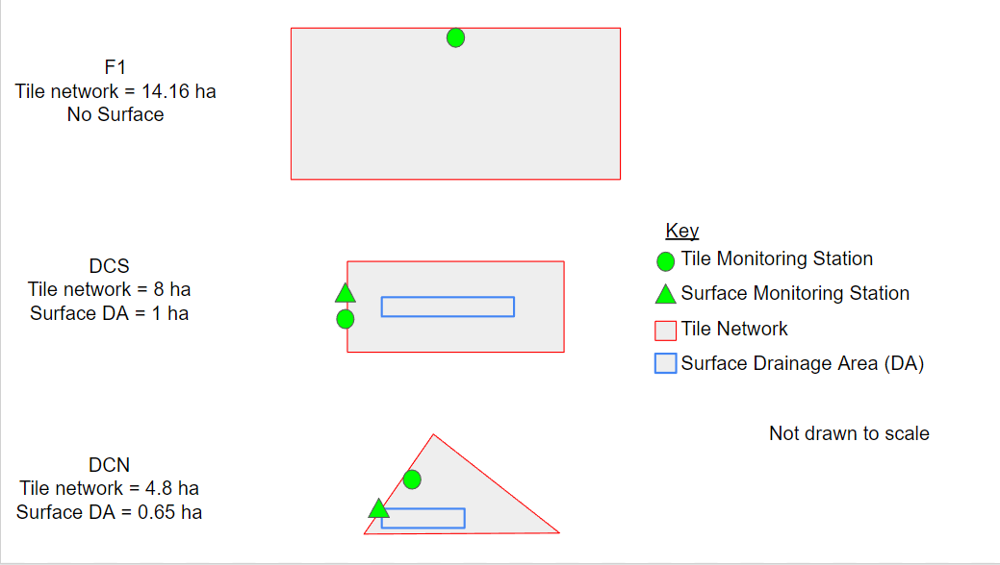

# Supplemental Materials 1 - Figures and Tables

```{r setup, echo = FALSE}
rm(list=ls(all=T))
knitr::opts_knit$set(root.dir = 'C:/RAR-Uvm/Data/Data for thesis')
```

```{r echo=FALSE, message=FALSE, warning=FALSE}
library(tidyverse)
library(knitr)
library(sjPlot)
library(lubridate)
library(table1)
library(kableExtra)
library(flextable)
library(purrr)
library(xtable)
library(Hmisc)
library(huxtable)
library(corrplot)
library(ggpubr)
library(gridExtra)
library(PerformanceAnalytics)
```

```{r echo=FALSE, message=FALSE}
# function for correlation matrix with p-values, uses Hmisc and xtable packages
# from http://www.sthda.com/english/wiki/elegant-correlation-table-using-xtable-r-package

# x is a matrix containing the data
# method : correlation method. "pearson"" or "spearman"" is supported
# removeTriangle : remove upper or lower triangle
# results :  if "html" or "latex"
  # the results will be displayed in html or latex format
corstars <-function(x, method=c("pearson", "spearman"), removeTriangle=c("upper", "lower"),
                     result=c("none", "html", "latex")){
    #Compute correlation matrix
    require(Hmisc)
    x <- as.matrix(x)
    correlation_matrix<-rcorr(x, type=method[1])
    R <- correlation_matrix$r # Matrix of correlation coeficients
    p <- correlation_matrix$P # Matrix of p-value 
    
    ## Define notions for significance levels; spacing is important.
    mystars <- ifelse(p < .0001, "****", ifelse(p < .001, "*** ", ifelse(p < .01, "**  ", ifelse(p < .05, "*   ", "    "))))
    
    ## trunctuate the correlation matrix to two decimal
    R <- format(round(cbind(rep(-1.11, ncol(x)), R), 2))[,-1]
    
    ## build a new matrix that includes the correlations with their apropriate stars
    Rnew <- matrix(paste(R, mystars, sep=""), ncol=ncol(x))
    diag(Rnew) <- paste(diag(R), " ", sep="")
    rownames(Rnew) <- colnames(x)
    colnames(Rnew) <- paste(colnames(x), "", sep="")
    
    ## remove upper triangle of correlation matrix
    if(removeTriangle[1]=="upper"){
      Rnew <- as.matrix(Rnew)
      Rnew[upper.tri(Rnew, diag = TRUE)] <- ""
      Rnew <- as.data.frame(Rnew)
    }
    
    ## remove lower triangle of correlation matrix
    else if(removeTriangle[1]=="lower"){
      Rnew <- as.matrix(Rnew)
      Rnew[lower.tri(Rnew, diag = TRUE)] <- ""
      Rnew <- as.data.frame(Rnew)
    }
    
    ## remove last column and return the correlation matrix
    Rnew <- cbind(Rnew[1:length(Rnew)-1])
    if (result[1]=="none") return(Rnew)
    else{
      if(result[1]=="html") print(xtable(Rnew), type="html")
      else print(xtable(Rnew), type="latex") 
    }
} 

# function to get plot limits, copied from https://stackoverflow.com/questions/7705345/how-can-i-extract-plot-axes-ranges-for-a-ggplot2-object
get_plot_limits <- function(plot) {
    gb = ggplot_build(plot)
    xmin = gb$layout$panel_params[[1]]$x.range[1]
    xmax = gb$layout$panel_params[[1]]$x.range[2]
    ymin = gb$layout$panel_params[[1]]$y.range[1]
    ymax = gb$layout$panel_params[[1]]$y.range[2]
    list(xmin = xmin, xmax = xmax, ymin = ymin, ymax = ymax)
}


```

```{r echo=FALSE, message=FALSE}
load('work1.Rdata')
load('work2.Rdata')
load('work3.Rdata')
```
  
**Table S1**
Master recession curve constants for each site
```{r echo = FALSE, warning = FALSE, fig.width=10,fig.height=10}
MRC<-read.csv(file = ".MRC results table.csv")

# swap AHS for F1
MRC[2,1]<-'F1'
MRC<-MRC[-1,]
rownames(MRC)<-c(1:3)
colnames(MRC)<-NULL

MRC%>% kbl()%>% add_header_above(c("", "Q_0 (L/s)", "abs(k)", "Q_0 (L/s)", "abs(k)", ""))%>% add_header_above(c(" ", "SF" = 2, "QF" = 2, "QF:SF ratio" = 1))%>%kable_classic(full_width = F, html_font = "Times")
```
  
  
**Table S2**  
Rainfall and tile discharge metrics for each site-event. G is growing, NG is non-growing
``` {r echo = FALSE, warning = FALSE}
t<-Total
t$Site<-as.factor(t$Site); t$Season<-as.factor(t$Season)
levels(t$Site)<-c("F1", "DCN", "DCS"); levels(t$Season)<-c("G", "NG")

t$SRP.Conc[t$Site == 'F1' & t$SRP.Conc == 0]<-NA
t$SRP.Load[t$Site == 'F1' & t$SRP.Load == 0]<-NA

t<-t %>% select(c(WY, Season, Season4,Event, Site, Rain,Volume,RR,response_time,peak_flow_rate,ttpm,mhri,Day.since.Manure,Day.since.P,TP.Load,TP.Conc,SRP.Load, SRP.Conc))%>%mutate(Rain = Rain*10)%>%mutate_if(is.numeric, round, 2)%>%arrange(Site,Event)%>%mutate(Event = format(Event, "%m-%d"))%>%setNames(c("WY", "Season", "Season4","Event", "Site", "Rain (mm)", "Volume (mm)", "R.R.","Response Time (hr)","Peak Flow Rate (mm/day)", "Time to Peak Flow (min)", "MHRI (mm/day)", "Days Since Manure App.", "Days Since P App.", "TP Load (g/ha)", "TP FWMC (ug/L)", "SRP Load (g/ha)", "SRP FWMC (ug/L)"))


t%>% kbl() %>% kable_classic(full_width = F, html_font = "Times") %>% kable_classic("striped", html_font = "Time")
```
  
  
```{r figurename1, echo=FALSE, fig.width=170}


# note you need to have a copy of the .png in the directory where the html is going ot be saved to for it to work, not sure why but this solutions worked for me
```
  
**Figure S1**
Map of study location in the northeast United States. State of Vermont in Orange and Addison County, Vermont in Black. Source: Jenny Bower, UVM PSS Department. Base layers obtained from the Vermont Center for Geographic Information and the U.S. Census Bureau.
  
```{r figurename3, echo=FALSE, fig.width=170}


# note you need to have a copy of the .png in the directory where the html is going ot be saved to for it to work, not sure why but this solutions worked for me
```
  
**Figure S2**
Images of sampling infrastructure.
  
```{r figurename2, echo=FALSE, fig.width=170}


# note you need to have a copy of the .png in the directory where the html is going ot be saved to for it to work, not sure why but this solutions worked for me
```
  
**Figure S3**
Field site schematics.
  
```{r echo = FALSE, warning = FALSE}

# kendall, rainfall - all data
Total %>% 
  # mutate(s = paste0(WY,Season))%>%
  # filter(s != "2021Growing")%>%
  # dplyr::select(-s)%>%
  dplyr::select(c(WaterYearDay,Rain,mhri,contains("prior"))) %>% 
  chart.Correlation(., histogram=T, pch=19, method = "kendall")
mtext("Kendall Correlations: Day of Hydrologic Year (All Data)", side=3, line=3) # add title outside pipe

# kendall, rainfall - remove growing season 2021, note
Total %>% 
  mutate(s = paste0(WY,Season))%>%
  filter(s != "2021Growing")%>%
  dplyr::select(-s)%>%
  dplyr::select(c(WaterYearDay,Rain,mhri,contains("prior"))) %>% 
  chart.Correlation(., histogram=T, pch=19, method = "kendall")
mtext("Kendall Correlations: Day of Hydrologic Year (Removed GS WY 2021 )", side=3, line=3) # add title outside pipe
```
  
p < .0001 `***`; p < .001 `**`, p < .01 `*`, p < .05 `.
  
**Figure S4**
Kendall correlations between event rainfall metrics and day of hydrologic year (Oct. 1 - Sep. 30), including all data (top) and removing the 2021 WY Growing season (bottom)
  
  
**Table S3**
Summary statistics for event tile discharge metrics for each site
```{r echo = FALSE, warning = FALSE}

table1(~ `Response Time (hr)` + `R.R.` + `Peak Flow Rate (mm/day)` + `TP Load (g/ha)` + `SRP Load (g/ha)` | Site, data=t)
```
  
  
```{r echo = FALSE, warning = FALSE}

# kendall, P
Total %>% 
  dplyr::select(c(Day.since.P,Day.since.Manure,contains("Load"),contains("Conc"))) %>% 
  chart.Correlation(., histogram=T, pch=19, method = "kendall")
mtext("Kendall Correlations: P Application Timing", side=3, line=3) # add title outside pipe
```
  
p < .0001 `***`; p < .001 `**`, p < .01 `*`, p < .05 `.`
  
**Figure S5**
Kendall correlations between P application periods (i.e. 'days since P application' and 'days since manure application') and event tile P discharge metrics
  
  
**Table S4**
Summary of flow pathway and source connectivity models for events included in the four-component hydrograph separation analysis. Time to peak in hours in parenthesis and all flow components are in mm
``` {r echo = FALSE, warning = FALSE}
## need to add time to peak in parathensis next to each cell to match nazari table format

EC_format<-EC[,c(3,6,14,21:36)]
names(EC_format)<-  c("siteXevent","Flow Volume (mm)","Time to Peak (hr)",
  "QF","QF TtP","SF" ,"SF TtP", "Old", "Old TtP" ,"New", "New TtP","QF old",   "QF old TtP","QF new","QF new TtP"  ,"SF old","SF old TtP","SF new","SF new TtP")
EC_format<-EC_format%>%
  mutate_if(is.numeric, round,1)
rownames(EC_format)<-EC_format[,1]
EC_format[,1]<-NULL
even_indexes<-seq(2,ncol(EC_format),2)# create indicies so can create seperate dataframes for flow and time metrics
odd_indexes<-seq(1,ncol(EC_format)-1, 2)
df_flow<-EC_format[,odd_indexes]
df_timetopeak<-EC_format[,even_indexes]
df_flow$`Total Rainfall (mm)`<-round(EC$total_rain, 2) # add rainfall to df_flow
EC_sitenames<-data.frame(EC$Site) # create summary stat rows
msums_DCS<-as.matrix(colSums(df_flow[EC_sitenames$EC.Site == "DCSSUB",]))
msums_DCN<-as.matrix(colSums(df_flow[EC_sitenames$EC.Site == "DCNSUB",]))
mmean<-as.matrix(round(colMeans(df_flow), 2))
msd<-as.matrix(round(apply(df_flow, 2, sd),2))

# # select columns for table and format
# EC_format<-EC[,-c(2,3,5:10, 12:15, 32:37)] can remove

# create dataframe with the two tables, pasting time metrics from second dataframe with ("") around it to the flow values, ttio = "two tables in one"

data_1<-lapply(1:ncol(df_flow[,-ncol(df_flow)]), function(i) paste0(df_flow[ , i], " (", df_timetopeak[ , i], ")"  ) )# note i goes from 1 to ncol-1, to skip rainfall column

data_1[[length(data_1)+1]]<-df_flow$`Total Rainfall (mm)` # need to add rainfall back

ttio <- as.data.frame(do.call(cbind, data_1)) # column bind

# add back row/column names
names(ttio) <- names(df_flow)
rownames(ttio)<-rownames(df_flow)

# add flow summary stats
nr<-nrow(ttio)

ttio[nr+1,]<-msums_DCS
ttio[nr+2,]<-msums_DCN
ttio[nr+3,]<-mmean
ttio[nr+4,]<-msd

# reorder to put rainfall first
ttio <- ttio %>%select(`Total Rainfall (mm)`, everything())
  

# change rownames for summary stats
rnnew<-c(rownames(df_flow), "DCS Sum", "DCN Sum", "Mean", "S.D.")
rownames(ttio)<-rnnew

# create table
ttio %>% kbl(table.attr = "style='width:150%;'") %>% kable_classic('striped', html_font = "Times")
```
  
  
**Table S5**
Pearson correlation matrix for rainfall and tile discharge metrics for events included in the four-component hydrograph separation. Units for the hydrograph separation components are ‘mm’ and all other units are the same as in Table S1
```{r, echo = FALSE, warning = FALSE}

tempEC<-EC[,c(6:18,21:36)]
colnames(tempEC)<-c("Volume", "Rain", "RR", "24 hr Rain", "7 day Rain","30 day Rain", "Peak Rainfall Intensity", "Response Time", "Time to Peak Flow", "Peak Flow Rate", "TP Load", "SRP Load", "PPL", names(tempEC)[c(14:29)])

corstars(tempEC) %>% kbl() %>% kable_classic(full_width = F, html_font = "Times")
```
p < .0001 `****`; p < .001 `***`, p < .01 `**`, p < .05 `*`
  
  
**Table S6**
Summary statistics for High and Low intensity rainfall pulses during events
```{r echo = FALSE, warning = FALSE}
# Hmisc::units
units(rainfall_pulse$pulse_length) <- "hours"
units(rainfall_pulse$pulse_sums) <- "mm"
units(rainfall_pulse$pulse_max) <- "mm/day"
units(rainfall_pulse$meanTP) <- "g/ha/day"
units(rainfall_pulse$meanSRP) <- "g/ha/day"
units(rainfall_pulse$meanPP) <- "g/ha/day"
units(rainfall_pulse$maxFlow) <- "mm/day"


table1::table1(~ pulse_length +pulse_sums + pulse_max + meanTP + meanSRP + meanPP + maxFlow | Q, data=rainfall_pulse, overall=F)

```
  
  
```{r, echo = FALSE, warning = FALSE, message = FALSE, fig.width=14,fig.height=12}

DCSflow<-hydrograph_plots[15:25]
DCSP<-facet_plots[15:25]
DCScombined<-rbind(DCSflow,DCSP)
DCNflow<-hydrograph_plots[1:14]
DCNP<-facet_plots[1:14]
DCNcombined<-rbind(DCNflow,DCNP)
legend_P<-cowplot::get_legend(DCScombined[[2]]) # create a ggplot object that is juslegend
DCScombined[[length(DCScombined)+1]]<-ggpubr::as_ggplot(legend_P)
DCNcombined[[length(DCNcombined)+1]]<-ggpubr::as_ggplot(legend_P) # add legend to plot lists

ggpubr::ggarrange(plotlist=DCScombined, cols = 2,common.legend = TRUE, legend="bottom")
ggpubr::ggarrange(plotlist=DCNcombined, cols = 2, common.legend = TRUE, legend="bottom")
```
  
**Figure S6**
Four component hydrograph separation (left) and P concentrations in event samples as a function of tile flow rate (right) for events included in the four-component hydrograph separation analysis at DCS (top) and DCN (bottom). F1 was omitted from this figure because only 1 event was in-cluded in the four-component hydrograph separation analysis. Note that the scale for DCN on 12/25/2020 is extended to show the high P concentrations

  